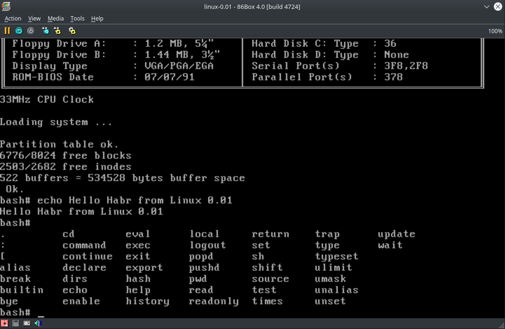

# intro
Я люблю старые программы, мне нравится их изучать и смотреть, как они развивались и во что сейчас превратились, или умерли, так и не дожив до сегодняшнего дня. Ещё мне нравится смотреть разные YouTube-каналы, посвящённые ретро-тематике, на которых рассказывают об истории программ, игр, игровых приставок или старых компьютеров. Хочу сказать всем этим людям «спасибо» за то, что сохраняете частичку истории технологий. И, вдохновившись их трудами, мне захотелось попробовать самому прикоснутся к истории, собрав и запустив что-то относительно старое, но до сих пор живущее и развивающееся. Мой выбор пал на первую версию Linux, а именно версию 0.01.

Те, кто знаком с ранними днями создания Linux, знают, что Линус Торвальдс писал её для компьютеров на основе 386-х процессоров в пропатченной версия Minix 1.5.10. И не смотря на то, что linux-0.01 собирали не раз, в том числе и на [современных версиях компилятора](https://www.opennet.ru/opennews/art.shtml?num=13523), мне хотелось побыть хоть немного в шкуре самого Линуса и самому собрать ядро в родной для этой ОС среде. А именно на максимально близком, хоть и виртуальном аппаратном обеспечении, в настоящей Minix 1.5.10 (точнее, Minix-386) с древней версией GCC 1.37.1

17 сентября ядру Linux исполнится 32 года. Это прекрасный повод вспомнить, как всё начиналось…

Статья доступна по ссылке: https://habr.com/ru/companies/vk/articles/752564/
